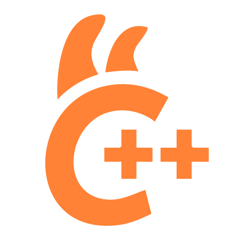

<p align="center">
  
</p>

# llama.cpp on StartOS

> **Upstream repo:** <https://github.com/ggml-org/llama.cpp>
>
> **Upstream `llama-server` docs:** <https://github.com/ggml-org/llama.cpp/blob/master/tools/server/README.md>
>
> Everything not listed here behaves the same as upstream `llama-server`. If a flag, endpoint, or behavior is not mentioned in this document, upstream documentation is accurate and fully applicable.

[llama.cpp](https://github.com/ggml-org/llama.cpp) is a high-performance C/C++ runtime for large language models in GGUF format. This package wraps its built-in HTTP server (`llama-server`), which exposes an OpenAI-compatible API and a small in-browser chat UI on the same port.

---

## Table of Contents

- [Image and Container Runtime](#image-and-container-runtime)
- [Volume and Data Layout](#volume-and-data-layout)
- [Installation and First-Run Flow](#installation-and-first-run-flow)
- [Configuration Management](#configuration-management)
- [Network Access and Interfaces](#network-access-and-interfaces)
- [Actions (StartOS UI)](#actions-startos-ui)
- [Dependencies](#dependencies)
- [Backups and Restore](#backups-and-restore)
- [Health Checks](#health-checks)
- [Limitations and Differences](#limitations-and-differences)
- [What Is Unchanged from Upstream](#what-is-unchanged-from-upstream)
- [Contributing](#contributing)
- [Quick Reference for AI Consumers](#quick-reference-for-ai-consumers)

---

## Image and Container Runtime

The package ships four variants, selected at build time via the `VARIANT` env var (driven by the `Makefile`):

| Variant   | Image                                      | Arches          | Accelerator   | Offered to GPU driver  |
| --------- | ------------------------------------------ | --------------- | ------------- | ---------------------- |
| `generic` | `ghcr.io/ggml-org/llama.cpp:server`        | x86_64, aarch64 | CPU only      | — (universal fallback) |
| `nvidia`  | `ghcr.io/ggml-org/llama.cpp:server-cuda`   | x86_64, aarch64 | CUDA (NVIDIA) | `nvidia`               |
| `rocm`    | `ghcr.io/ggml-org/llama.cpp:server-rocm`   | x86_64          | ROCm (AMD)    | `amdgpu`               |
| `vulkan`  | `ghcr.io/ggml-org/llama.cpp:server-vulkan` | x86_64, aarch64 | Vulkan        | `i915` (Intel)         |

All four variants publish under a single package version. Each declares a distinct `hardwareRequirements.device` (the host GPU's kernel driver), so StartOS serves each host the most specific variant its detected hardware satisfies — `nvidia`/`rocm`/`vulkan` for matching GPUs, and `generic` as the universal CPU fallback for everything else. Note that `vulkan` matches only Intel GPUs on the `i915` driver; newer Intel GPUs on the `xe` driver (and non-Intel Vulkan-only setups) fall back to `generic`.

| Property     | Value               |
| ------------ | ------------------- |
| Entrypoint   | `/app/llama-server` |
| Working dir  | `/app`              |
| Default port | 8080                |

---

## Volume and Data Layout

| Volume | Mount Point | Purpose                                                        |
| ------ | ----------- | -------------------------------------------------------------- |
| `main` | `/data`     | `store.json` (API key + serve args) and `models/` (GGUF cache) |

The container runs with `LLAMA_CACHE=/data/models` and `HF_HOME=/data/huggingface`, so all `-hf <repo>` downloads land on the persistent volume.

---

## Installation and First-Run Flow

| Step            | StartOS                                                                                                                               |
| --------------- | ------------------------------------------------------------------------------------------------------------------------------------- |
| Install         | Marketplace install or sideload `.s9pk`                                                                                               |
| First-run tasks | Two `critical` tasks are auto-created: **Get API Credentials** (retrieve auto-generated key) and **Set Model** (choose what to serve) |
| Start service   | After **Set Model** has been run; until then the daemon idles                                                                         |
| Pull the model  | Automatic on first start (cached on the `main` volume)                                                                                |

Until **Set Model** has been run, the daemon stays in an idle (`sleep infinity`) state and the API port is closed — the health check reports "No model selected." Once a model is selected, llama-server is restarted with the chosen serve arguments.

---

## Configuration Management

Configuration is stored at `/data/store.json` and managed via the **Set Model** action:

```json
{
  "apiKey": "<32-char auto-generated key>",
  "serveArgs": [
    "-hf",
    "unsloth/Qwen2.5-7B-Instruct-GGUF:Q4_K_M",
    "-c",
    "8192",
    "-ngl",
    "999"
  ]
}
```

`serveArgs` is the exact list of arguments appended after `/app/llama-server`. The daemon adds `--host 0.0.0.0`, `--port 8080`, and `--api-key <apiKey>` at runtime.

**Curated presets:** the Set Model action surfaces a hardware-tier-aware list of GGUF presets and disables ones too large for the detected memory:

| Preset                         | Repo (`-hf`)                                              | Min memory |
| ------------------------------ | --------------------------------------------------------- | ---------- |
| Llama 3.2 1B Instruct          | `unsloth/Llama-3.2-1B-Instruct-GGUF:Q4_K_M`               | 2 GB       |
| Llama 3.2 3B Instruct          | `unsloth/Llama-3.2-3B-Instruct-GGUF:Q4_K_M`               | 4 GB       |
| Qwen2.5 7B Instruct            | `unsloth/Qwen2.5-7B-Instruct-GGUF:Q4_K_M`                 | 6 GB       |
| Llama 3.1 8B Instruct          | `unsloth/Meta-Llama-3.1-8B-Instruct-GGUF:Q4_K_M`          | 8 GB       |
| Qwen2.5 14B Instruct           | `unsloth/Qwen2.5-14B-Instruct-GGUF:Q4_K_M`                | 12 GB      |
| Mistral Small 3.2 24B Instruct | `unsloth/Mistral-Small-3.2-24B-Instruct-2506-GGUF:Q4_K_M` | 18 GB      |
| Qwen3 30B-A3B Instruct         | `unsloth/Qwen3-30B-A3B-Instruct-2507-GGUF:Q4_K_M`         | 22 GB      |
| Qwen2.5 32B Instruct           | `unsloth/Qwen2.5-32B-Instruct-GGUF:Q4_K_M`                | 24 GB      |
| Llama 3.3 70B Instruct         | `unsloth/Llama-3.3-70B-Instruct-GGUF:Q4_K_M`              | 48 GB      |

The **Custom** variant accepts a HuggingFace repo, optional filename, context size, GPU layer count, and extra `llama-server` flags. For settings that can't be expressed cleanly via the form (quoted JSON, multi-word strings), edit `store.json` directly.

---

## Network Access and Interfaces

| Interface        | Port | Protocol | Type | Purpose                                  |
| ---------------- | ---- | -------- | ---- | ---------------------------------------- |
| llama.cpp Server | 8080 | HTTP     | `ui` | Built-in chat UI + OpenAI-compatible API |

The chat UI and the API share a single port. Access methods (StartOS 0.4.x): LAN IP, `<hostname>.local`, Tor `.onion`, and custom domains if configured. All OpenAI-compatible clients should use base URL `<interface-url>/v1` and pass the API key as `Authorization: Bearer <key>`.

Selected upstream endpoints:

| Endpoint               | Method | Purpose                                          |
| ---------------------- | ------ | ------------------------------------------------ |
| `/v1/chat/completions` | POST   | OpenAI-compatible chat                           |
| `/v1/completions`      | POST   | OpenAI-compatible text completion                |
| `/v1/embeddings`       | POST   | Embeddings (when the loaded model supports them) |
| `/health`              | GET    | Health probe                                     |
| `/props`               | GET    | Loaded model info                                |

The full surface area is documented in upstream `tools/server/README.md`.

---

## Actions (StartOS UI)

| Action                  | Purpose                                                                                                                                                   |
| ----------------------- | --------------------------------------------------------------------------------------------------------------------------------------------------------- |
| **Set Model**           | Choose a curated preset (with hardware-tier-aware availability) or a custom HuggingFace GGUF. Writes `serveArgs` to `store.json` and restarts the daemon. |
| **Get API Credentials** | Return the auto-generated API key. Surfaced once on install via a `critical` task.                                                                        |
| **Delete Model Cache**  | Remove a specific filename from `/data/models` to reclaim disk space.                                                                                     |

---

## Dependencies

None.

---

## Backups and Restore

**Included in backup:**

- `main` volume — `store.json` _and_ all cached GGUF weights under `models/`.

**Restore behavior:**

- API key, serve args, and any locally cached models are restored verbatim. No reconfiguration needed.

Backups can be very large depending on how many models you've cached — a single 70B Q4 file is ~40 GB.

---

## Health Checks

| Check         | Method                 | Grace period                            | Messages                                                                                                              |
| ------------- | ---------------------- | --------------------------------------- | --------------------------------------------------------------------------------------------------------------------- |
| llama.cpp API | Port listening on 8080 | 60 minutes (cold-cache model downloads) | "The llama.cpp API is ready" / "The llama.cpp API is not ready" or "No model selected. Run the \"Set Model\" action." |

---

## Limitations and Differences

1. **One model per process.** llama-server holds a single GGUF in memory. To switch models, run **Set Model** again — the service restarts with the new weights.
2. **Custom-action arg splitting.** The Custom variant's `Extra arguments` field is split on whitespace, so JSON values with quoted spaces will not survive — edit `store.json` directly for those.
3. **Hardware-tier detection is best-effort.** GPU memory is read from `nvidia-smi` / `rocm-smi`; on Vulkan and unsupported topologies, the preset filter falls back to total system RAM as a memory budget.
4. **Variants are independent installs.** Switching from e.g. `generic` to `nvidia` is an uninstall + reinstall, not an in-place change; cached models on the `main` volume can be restored from backup.

---

## What Is Unchanged from Upstream

- The full `llama-server` HTTP API and built-in chat UI.
- All `llama-server` CLI flags — anything not consumed by the package wrapper passes straight through (via the Custom variant's extra args).
- HuggingFace `-hf` model downloads and the `LLAMA_CACHE` layout.
- GGUF model support, embedding endpoints, OpenAI-compatible response shapes, and tool-call formats.

---

## Contributing

See [CONTRIBUTING.md](CONTRIBUTING.md) for build instructions and development workflow, and [UPDATING.md](UPDATING.md) for the upstream-bump procedure.

---

## Quick Reference for AI Consumers

```yaml
package_id: llama-cpp
hardware_acceleration: true
variants: # all publish under one version; StartOS matches by detected GPU driver
  generic:
    image: ghcr.io/ggml-org/llama.cpp:server
    arch: [x86_64, aarch64]
    accel: cpu
    gpu_driver: null # universal CPU fallback
  nvidia:
    image: ghcr.io/ggml-org/llama.cpp:server-cuda
    arch: [x86_64, aarch64]
    accel: cuda
    gpu_driver: nvidia
  rocm:
    image: ghcr.io/ggml-org/llama.cpp:server-rocm
    arch: [x86_64]
    accel: rocm
    gpu_driver: amdgpu
  vulkan:
    image: ghcr.io/ggml-org/llama.cpp:server-vulkan
    arch: [x86_64, aarch64]
    accel: vulkan
    gpu_driver: i915 # Intel GPUs only
volumes:
  main: /data
ports:
  api_and_ui: 8080
env:
  LLAMA_CACHE: /data/models
  HF_HOME: /data/huggingface
dependencies: none
startos_managed_args: ['--host 0.0.0.0', '--port 8080', '--api-key <stored>']
actions:
  - set-model
  - get-api-credentials
  - delete-model-cache
```
