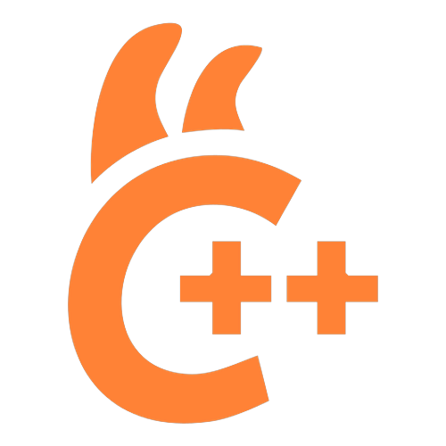

<p align="center">
  
</p>

# llama.cpp on StartOS

> Everything not listed in this document should behave the same as upstream
> llama.cpp. If a feature, setting, or behavior is not mentioned here, the
> upstream documentation is accurate and fully applicable — see the
> Documentation section of `instructions.md` for links.

[llama.cpp](https://github.com/ggml-org/llama.cpp) runs large language models locally and serves them over an OpenAI-compatible API. This package ships one build per accelerator, sizes its model presets to the hardware it finds, and puts authentication in front of a server that has none of its own.

- **Upstream repo:** <https://github.com/ggml-org/llama.cpp>
- **Wrapper repo:** <https://github.com/Start9Labs/llama-cpp-startos>

---

## Table of Contents

- [Image and Container Runtime](#image-and-container-runtime)
- [Volume and Data Layout](#volume-and-data-layout)
- [File Models](#file-models)
- [Dependencies](#dependencies)
- [Network Access and Interfaces](#network-access-and-interfaces)
- [Installation and First-Run Flow](#installation-and-first-run-flow)
- [Actions](#actions)
- [Tasks](#tasks)
- [Health Checks](#health-checks)
- [Backups and Restore](#backups-and-restore)
- [Limitations and Differences](#limitations-and-differences)
- [Quick Reference for AI Consumers](#quick-reference-for-ai-consumers)

---

## Image and Container Runtime

The upstream image is used unmodified, but **the package is built four times** — one variant per accelerator — and StartOS installs whichever matches your hardware.

| Variant   | Upstream image | Architectures   | Selected when                                |
| --------- | -------------- | --------------- | -------------------------------------------- |
| `generic` | CPU server     | x86_64, aarch64 | Nothing more specific matches — the fallback |
| `nvidia`  | CUDA server    | x86_64, aarch64 | An NVIDIA GPU on the `nvidia` driver         |
| `rocm`    | ROCm server    | x86_64          | A **discrete** AMD GPU on `amdgpu`           |
| `vulkan`  | Vulkan server  | x86_64, aarch64 | An Intel GPU on the `i915` driver            |

Selection is StartOS's, from the hardware requirements each variant declares; the most specific compatible one wins, and `generic` is the only variant with no requirement.

The AMD requirement matches discrete cards by product name rather than excluding integrated ones, because ROCm is unreliable on integrated Radeon graphics and the matcher has no way to express an exclusion.

| Subcontainer                                 | Purpose                                          |
| -------------------------------------------- | ------------------------------------------------ |
| `llama-cpp-sub`                              | The `primary` daemon, and the one to `attach` to |
| `detect-nvidia`, `detect-rocm`, `detect-mem` | Temporary; used to size the model presets        |
| `delete-cache`                               | Temporary; the Delete Model Cache action         |

## Volume and Data Layout

One volume, and most of it is downloaded models.

| Volume | Mount Point | Purpose                                                                         |
| ------ | ----------- | ------------------------------------------------------------------------------- |
| `main` | `/data`     | `store.json`, the GGUF model cache under `models/`, and HuggingFace's own cache |

Models are the bulk of it — a single quantized model runs from roughly one to forty gigabytes depending on size.

## File Models

One model. Two of its keys decide whether the service can run at all; the third only exists so a form can remember what you last told it.

| File         | Format | Modelled                | Written by                                |
| ------------ | ------ | ----------------------- | ----------------------------------------- |
| `store.json` | JSON   | Yes — `FileHelper.json` | The Set Model and Set UI Password actions |

| Key              | Notes                                                                                           |
| ---------------- | ----------------------------------------------------------------------------------------------- |
| `serveArgs`      | The full argument list handed to `llama-server`, composed by the Set Model action               |
| `uiPassword`     | The password for the proxy's basic auth; the username is always `admin`                         |
| `modelSelection` | What the Set Model form last submitted, so it can be prefilled next time — read by nothing else |

Nothing else writes the file, and neither `serveArgs` nor `uiPassword` is defaulted — both are absent until you run their action, and each absence raises a task.

`modelSelection` holds the chosen `selection` plus, when Custom was chosen, a `custom` object carrying that variant's fields; picking a preset clears `custom`. The daemon never reads it, so it cannot disagree with `serveArgs` about what is actually running — at worst it prefills a form with a stale answer.

**No configuration file reaches the application.** Two environment variables are set, both redirecting caches onto the volume so downloaded weights survive a container rebuild:

| Variable      | Value               |
| ------------- | ------------------- |
| `LLAMA_CACHE` | `/data/models`      |
| `HF_HOME`     | `/data/huggingface` |

Everything else about how the model is served is in `serveArgs`, and the package always appends the host and port itself so the server binds where the interface expects it.

## Dependencies

None.

## Network Access and Interfaces

One interface, serving both the OpenAI-compatible API and llama.cpp's built-in chat UI.

| Interface        | Id    | Type | Port | Description                          |
| ---------------- | ----- | ---- | ---- | ------------------------------------ |
| llama.cpp Server | `api` | ui   | 8080 | The API and the built-in chat client |

**Authentication is added by StartOS, not by llama.cpp.** The server itself runs keyless; the binding declares HTTP basic auth at the edge, with the username `admin` and the password from `store.json`. Until a password is set the binding is configured with an empty one — which never serves anything, because the service is blocked from starting by a `critical` task at the same time.

An OpenAI-compatible client therefore needs those basic-auth credentials as well as whatever it would normally send.

## Installation and First-Run Flow

Install writes nothing and the service starts idle: **two `critical` tasks** stand between a fresh install and a working one, and both must be cleared.

1. **Set UI Password** — until then there is no credential in front of the API.
2. **Set Model** — until then there is nothing to serve. The daemon runs but does no work, and its health check says so by name.

Both are raised by a condition rather than at install time, so they reappear if either value is later cleared.

The first start after choosing a model **downloads it**, which is why the health check allows an hour before reporting failure. A large model on a slow connection can take most of that.

## Actions

Three actions, all user-facing.

### Set Model

Chooses what the server runs — either a curated preset or a model of your own.

- **What it changes:** `serveArgs` and `modelSelection` in `store.json`, replacing each entirely.
- **Cost:** seconds to write, then a restart — and, if the model is not already cached, a download that can take a long time.
- **Repeat safety:** safe to re-run. Switching back to a previously used model is fast, because the old one is still cached.
- **The form reopens on your current selection**, read back from `modelSelection`, so changing one setting does not mean re-entering the rest. With nothing chosen yet it falls back to the hardware-filtered default.
- **Presets are filtered to your hardware.** The form reads the accelerator's memory — VRAM on NVIDIA and ROCm, system memory otherwise — and disables any preset that would not fit, defaulting to the smallest that does. The estimate is the quantized weights plus roughly a quarter for the context cache.
- **Custom** takes a HuggingFace GGUF repo, optionally a specific file, a context size, a GPU-layer count, and extra server flags. Those extra flags are split on whitespace, so a quoted value with spaces will not survive.

### Set UI Password

Generates the password for the API and chat UI.

- **What it changes:** `uiPassword` in `store.json`, and through it the binding's basic-auth credential.
- **Cost:** seconds, then a restart.
- **Repeat safety:** safe to re-run, but it **replaces** the existing password — every saved client login has to be updated.
- **Outputs:** the username `admin` and the new password.

### Delete Model Cache

Removes one downloaded model file to reclaim disk.

- **What it changes:** deletes the named file from the model cache. Path separators are stripped from the input, so it cannot reach outside that directory.
- **Repeat safety:** idempotent; deleting a file that is not there succeeds.
- **Not reversible**, but not destructive either — the model is re-downloaded if selected again.

## Tasks

Two tasks, both raised by a condition rather than at install, and both blocking.

| Task            | Severity   | Raised when                   | Cleared when    |
| --------------- | ---------- | ----------------------------- | --------------- |
| Set UI Password | `critical` | Whenever no password is set   | The action runs |
| Set Model       | `critical` | Whenever no model is selected | The action runs |

Because they are conditional, clearing either value later raises its task again rather than leaving the service running unauthenticated or idle.

## Health Checks

One check, on the daemon.

| Check                     | Method                 | Grace Period |
| ------------------------- | ---------------------- | ------------ |
| `primary` "llama.cpp API" | Port 8080 is listening | 1 hour       |

**The hour-long grace is for the model download**, which happens on the first start after a selection and is bounded only by size and bandwidth.

With no model selected the daemon idles rather than exiting, and the check's failure message names the action to run — so an unconfigured install reports what to do rather than looking broken.

## Backups and Restore

The `main` volume is copied wholesale — `sdk.Backups.ofVolumes('main')`. No dump step and nothing excluded.

**That means the model cache is in the backup**, which is very likely the largest thing on the server. A backup of this service is dominated by weights that could be re-downloaded instead; [Delete Model Cache](#actions) is the way to trim what gets captured.

- **Included:** `store.json` with the model selection and password, and every downloaded model.
- **Restore:** complete, and no tasks are raised — the selection and password come back, and the model is already cached, so the first start does not re-download.

## Limitations and Differences

1. **Two settings are required before the service does anything**, and each is enforced by a blocking task rather than defaulted.
2. **Authentication is the reverse proxy's, not llama.cpp's.** Every client, including API clients, must send basic-auth credentials.
3. **Which accelerator variant you get is decided by StartOS**, from the hardware present; it is not a setting.
4. **Integrated AMD graphics fall back to the generic CPU build.** ROCm is matched only for discrete cards.
5. **The Vulkan variant matches Intel GPUs only**, on the `i915` driver.
6. **Model presets are filtered by detected memory**, and the fit estimate is approximate — a preset that is enabled can still be tight at large context sizes.
7. **Extra server flags are split on whitespace**, so quoted arguments containing spaces do not survive.
8. **Models are included in backups.** Expect the backup to be as large as the cache.

---

## Quick Reference for AI Consumers

```yaml
package_id: llama-cpp
image: ghcr.io/ggml-org/llama.cpp # server, server-cuda, server-rocm, or server-vulkan per variant
architectures:
  - x86_64
  - aarch64 # not for the rocm variant
subcontainers:
  - llama-cpp-sub # the running daemon
  - detect-nvidia # temporary; preset sizing
  - detect-rocm # temporary; preset sizing
  - detect-mem # temporary; preset sizing
  - delete-cache # temporary; the Delete Model Cache action
volumes:
  main: /data
file_models:
  - store.json
startos_managed_env_vars:
  - LLAMA_CACHE
  - HF_HOME
dependencies: []
interfaces:
  api: { type: ui, port: 8080 } # basic auth enforced at the edge, username "admin"
actions:
  - set-model
  - set-ui-password
  - delete-model-cache
tasks:
  - { action: set-ui-password, severity: critical }
  - { action: set-model, severity: critical }
health_checks:
  - primary # displayed "llama.cpp API"; 1-hour grace covers the model download
```
